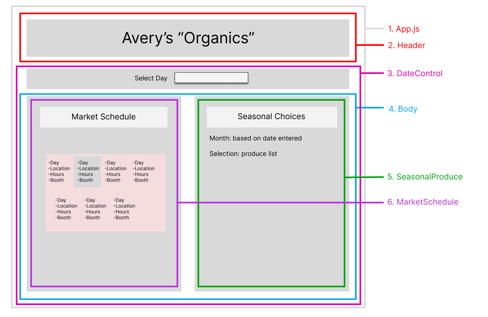

# Avery's "Organics"
#### By Alex Johnson, Aitana Shough

A client for users to view where they can buy some vegetables

[Component Diagram](#component-diagram)

[Setup/Installation Guide](#setup/installation-guide)

[Bugs](#known-bugs)

[License](#license)

## Technologies Used

   * javascript
   * react
   * eslint
   * babel
   * webpack
   * jest

## User Stories
  * Avery's Organics is a mid-sized farm in Northern Oregon that grows organic produce and sells it at farmers markets throughout town. Since Avery's is at a different market almost every day, they've asked for a website to show customers which market they will be at on a given day.

  * Avery's also grows different crops in different seasons. They'd like to display what produce is available during which months on their site too.

## Component Diagram

### Running the Application

* `npm start`
Runs the app in the development mode.\
Open [http://localhost:3000](http://localhost:3000) to view it in your browser.

The page will reload when you make changes.\
You may also see any lint errors in the console.

* `npm run build`
Runs the application

## Known Bugs
- Chrome users have issue with the first date selection not working. Will work on second click.
- date field in form doesn't update, but shows correct information based on date picked.

## Thanks
 * Dr. Richard Garfield
 * Kimbo Slice

## License

MIT License

Copyright (c) 2023 Alex Johnson, Aitana Shough

Permission is hereby granted, free of charge, to any person obtaining a copy of this software and associated documentation files (the "Software"), to deal in the Software without restriction, including without limitation the rights to use, copy, modify, merge, publish, distribute, sublicense, and/or sell copies of the Software, and to permit persons to whom the Software is furnished to do so, subject to the following conditions:

The above copyright notice and this permission notice shall be included in all copies or substantial portions of the Software.

THE SOFTWARE IS PROVIDED "AS IS", WITHOUT WARRANTY OF ANY KIND, EXPRESS OR IMPLIED, INCLUDING BUT NOT LIMITED TO THE WARRANTIES OF MERCHANTABILITY, FITNESS FOR A PARTICULAR PURPOSE AND NONINFRINGEMENT. IN NO EVENT SHALL THE AUTHORS OR COPYRIGHT HOLDERS BE LIABLE FOR ANY CLAIM, DAMAGES OR OTHER LIABILITY, WHETHER IN AN ACTION OF CONTRACT, TORT OR OTHERWISE, ARISING FROM, OUT OF OR IN CONNECTION WITH THE SOFTWARE OR THE USE OR OTHER DEALINGS IN THE SOFTWARE.
